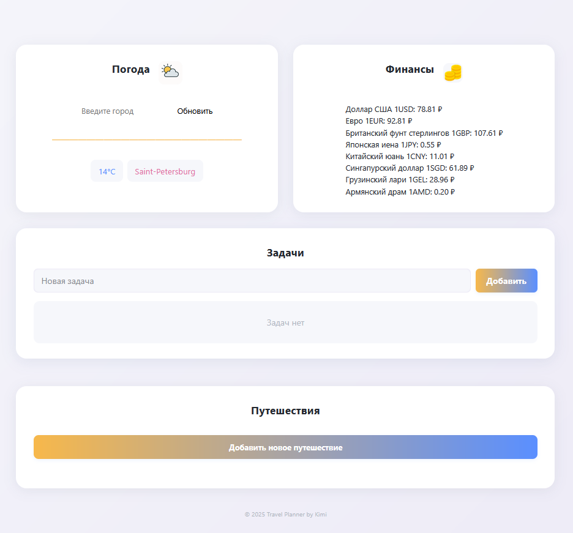

# Dashboard Vanilla JS [Ссылка на сайт](https://itsbestusername.github.io/dashboard-vanilla-js/)

Многофункциональный дашборд для путешественников и не только — на чистом JavaScript, с авторизацией через Supabase, планированием поездок, задачами, погодой и курсами валют.

---

## Возможности

- **Авторизация и регистрация** (Supabase)
- **Погода** по выбранному городу (Open-Meteo, OpenStreetMap)
- **Курсы валют** (open.er-api.com)
- **ToDo-лист** (персональные задачи, сохраняются в Supabase)
- **Планировщик путешествий** (создание поездок, дней, событий, бюджетирование)
- Современный адаптивный интерфейс

---

## Скриншот



---

## Быстрый старт

1. **Клонируйте репозиторий:**
   ```bash
   git clone https://github.com/itsbestusername/dashboard-vanilla-js
   cd dashboard-vanilla-js
   ```
2. **Откройте `index.html` в браузере** 

---

## Использование

1. **Зарегистрируйтесь** или войдите через email и пароль. (После регистрации необходимо подтвердить почту в письме, просто открыв ссылку)
2. После входа доступны:
   - **Погода:** введите город, чтобы узнать текущую погоду.
   - **Финансы:** смотрите актуальные курсы валют.
   - **Задачи:** добавляйте, отмечайте и удаляйте свои задачи.
   - **Путешествия:** создавайте поездки, добавляйте дни и события, ведите бюджет.
3. **Выйти** — кнопка в шапке.

---

## Технологии

- **Vanilla JS** 
- **Supabase** (аутентификация, хранение задач и поездок)
- **Open-Meteo API** (погода)
- **OpenStreetMap Nominatim** (геокодинг городов)
- **open.er-api.com** (валюты)
- **CSS** (адаптивная верстка, отдельные стили для каждого блока)

---

## Настройка Supabase (если хотите свой бэкенд)

1. Зарегистрируйтесь на [supabase.com](https://supabase.com/).
2. Создайте проект, получите URL и анонимный ключ.
3. В файле `src/js/supabaseClient.js` замените значения `SUPABASE_URL` и `SUPABASE_ANON_KEY` на свои.
4. Создайте таблицы:
   - `tasks` (id, user_id, text, done)
   - `trips` (id, user_id, data)

---

_Проект создан для личного пользования и обучения. Свободно используйте и дорабатывайте!_ 
